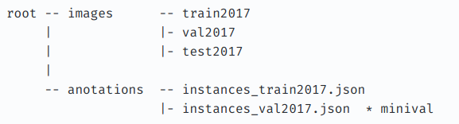

# detectron2

This repository shows how to use Detectron2 (framework for computer vision made by facebook) for coco datasets.

The dataset is val2017.

```
wget http://images.cocodataset.org/zips/val2017.zip
weet http://images.cocodataset.org/annotations/annotations_trainval2017.zip
```

They need to be arranged like the below:


